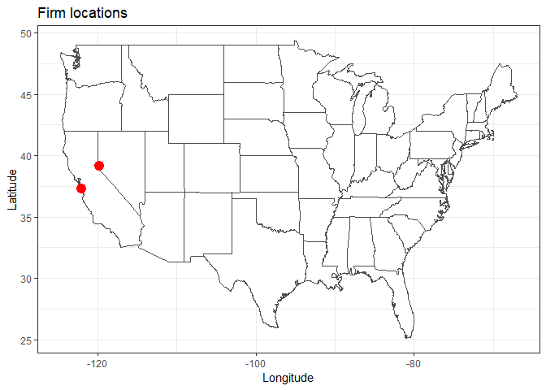

Getting location
----------------

It turns out that company addresses are not sufficient -- we need geographical locations in terms of latitude and longitude as well. One good news is that `ggmap` can handle this pretty well. Construct the following function that returns the address given an addresss string:

``` r
GetGeocode <- function (address) {
  geocode(address, source = "dsk") # extract geocode using Data Science Toolkit
}
```

For instance, the geocode of company `BOREALIS TECHNOLOGY CORP` from `https://www.sec.gov/cgi-bin/browse-edgar?action=getcompany&CIK=0001014767&owner=include&count=40&hidefilings=0` can be found by passing their business address:

``` r
address <- "4070 SILVER SAGE DR\nSTE 211\nCARSON CITY NV 89701"
GetGeocode(address)
```

    ## Information from URL : http://www.datasciencetoolkit.org/maps/api/geocode/json?address=4070%20SILVER%20SAGE%20DR%0ASTE%20211%0ACARSON%20CITY%20NV%2089701&sensor=false

    ##         lon      lat
    ## 1 -119.7636 39.13062

where `lon` and `lat` indicate its longitude and latitude respectively.

### Multiple locations

Getting multiple locations can be done by using `lapply` function:

``` r
addresses <- c("4070 SILVER SAGE DR\nSTE 211\nCARSON CITY NV 89701",
               "ONE APPLE PARK WAY\nCUPERTINO CA 95014")
locations <- lapply(addresses, GetGeocode)
```

    ## Information from URL : http://www.datasciencetoolkit.org/maps/api/geocode/json?address=ONE%20APPLE%20PARK%20WAY%0ACUPERTINO%20CA%2095014&sensor=false

``` r
print(locations)
```

    ## [[1]]
    ##         lon      lat
    ## 1 -119.7636 39.13062
    ## 
    ## [[2]]
    ##         lon     lat
    ## 1 -122.0359 37.3251

`lapply` performs broadcasting a given function (second parameter) to a vector (first parameter) and returns a list, which is why it is called *l*`apply`. To extract longitudes and latitudes, one can call the followings.

``` r
lons <- sapply(locations, "[[", "lon") # extract lon elements from a list of lists
lats <- sapply(locations, "[[", "lat") # extract lat elements from a list of lists
location.df <- data.frame(lon = lons, lat = lats)
```

Plotting locations
------------------

``` r
ggplot(location.df, aes(x=lon, y=lat)) + 
  borders("usa", colour="gray50", fill="white") +
  geom_point(color="red", size=4) +
  labs(x = "Longitude", y = "Latitude", title = "Firm locations") +
  theme_bw()
```

    ## Warning: package 'maps' was built under R version 3.5.1



TODO: it might be interesting to see location difference across industries.
